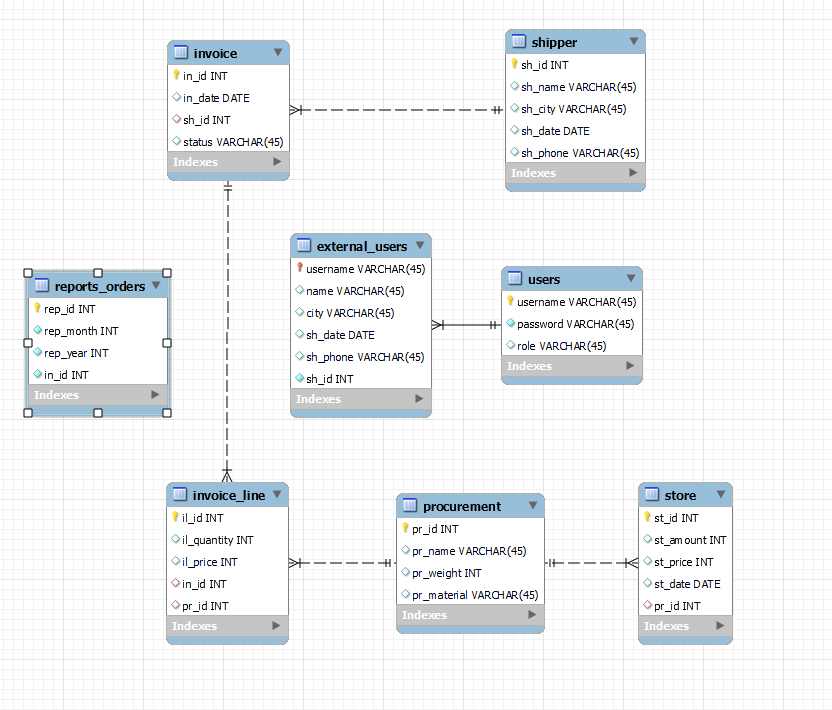

# storage-information-system

Курсовая работа по теме "Информационная система учета поставок на склад"

Была разработана информационная система для учёта поставок на склад, написанная на Python и использующая фреймворк Flask. Проект начинался с этапа предварительного планирования, в рамках которого была разработана вся требуемая документация. Созданное приложение обеспечивает пользователям информационной системы возможность взаимодействия с базой данных через веб-интерфейс. Оно предлагает пользователям функционал для осуществления множества сценариев использования, поддерживая бизнес-процессы и интегрируясь с базой данных.

**Инфологическая модель базы данных.**

